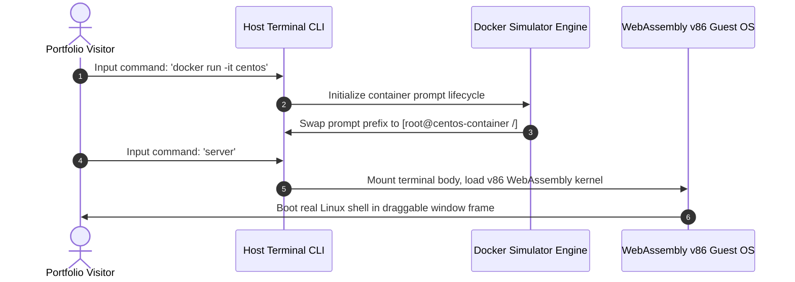

# 💻 Interactive Linux Desktop Portfolio (Serverless Unix Workspace)

<p align="center">
  <a href="https://github.com/tirthpatel90/My-Portfolio-/stargazers"></a>
  <a href="https://github.com/tirthpatel90/My-Portfolio-/network/members"></a>
  <a href="https://github.com/tirthpatel90/My-Portfolio-/blob/main/LICENSE"></a>
</p>

<p align="center">
  <strong>A premium, fully interactive, browser-based Linux Desktop Environment styled as a Unix workspace. Fully serverless, running mock Docker containers and booting real WebAssembly-based Alpine Linux operating systems locally on the client side!</strong>
</p>

---

## 🌐 Live Mainframe Demo
Try the interactive shell environment live here: **[tirthdev-portfolio.vercel.app](https://tirthdev-portfolio.vercel.app/)**

---

## 🎯 Project Vision
Most developer portfolios are static templates. This repository contains a fully functional **virtual desktop environment** built with vanilla web technologies. It is designed specifically for **DevOps, Cloud, Systems, and Backend Engineers** to showcase infrastructure administration, shell operations, container orchestration, and system configurations interactively.

---

## ✨ Key Capabilities & Mocks

### 🖥️ 1. Client-Side WebAssembly Terminal (Path A)
Spawns a draggable, retro terminal window running a **real, serverless virtual machine emulator** in-browser via WebAssembly (`v86`).
*   **100% Free Hosting:** Virtualization executes entirely in the visitor's browser thread via Wasm. No virtual private servers (VPS) are rented or required, meaning your portfolio hosting is completely free.
*   **Draggable Terminal Overlay:** Fitted with customized, sleek webkit-scrollbars that match your desktop themes.
*   **Supported Operating Systems:** The underlying `v86` emulator runs a real x86 emulation layer in WebAssembly. You can configure it to load several pre-configured operating system profiles:
    *   🐧 **Alpine Linux (Default):** A super-lightweight security-oriented Linux server shell (`profile=alpine`).
    *   🚀 **Arch Linux:** A customized 32-bit Linux terminal containing packages like Python, Git, and system logs (`profile=archlinux`).
    *   📦 **NodeOS:** A lightweight operating system built on top of the Linux kernel, using Node.js as the primary userspace runtime (`profile=nodeos`).
    *   🛠️ **Buildroot Linux:** A minimal embedded Linux setup precompiled with networking utilities (`profile=buildroot`).
    *   💾 **FreeDOS:** A complete, free MS-DOS compatible operating system for running legacy command-line applications (`profile=freedos`).
    *   🛡️ **OpenBSD:** A security-focused, multi-platform Unix-like operating system (`profile=openbsd`).
    *   🐦 **KolibriOS:** An extremely fast assembly-written graphical OS (`profile=kolibrios`).
    *   💻 **Damn Small Linux:** A 50MB lightweight desktop environment precompiled with legacy Firefox web browsers (`profile=dsl`).
    *   🏁 **Windows 98:** A classic retro Windows desktop GUI running in-browser (`profile=windows98`).


### 🐳 2. Simulated Docker Container Engine
Allows recruiters to run mock container commands (`docker run -it centos`) inside the host prompt.
*   **Environment Shifting:** Swaps console variables to warning-red root layouts (`[root@centos-container /]#`).
*   **Isolated Filesystems:** Simulates internal directory structures (`/bin`, `/etc`, `/var`, `/opt`).
*   **InstallerStdout Simulation:** Type `yum install nginx` or `apt install nginx` to execute complete download sequences, package validations, and setup loops mimicking real Linux installer outputs.

### 🎨 3. Glassmorphic Desktop Window System
*   **Draggable & Maximizable Windows:** Draggable desktop app containers (`about`, `skills`, `projects`, `files`, `connect`) with double-click window focus management.
*   **Theme Switcher Engine:** Change background styles dynamically (Dracula Dark, Matrix Green, GitHub Dark, Tokyo Night, Midnight Black) via console commands (`theme [name]`) or the floating settings gear widget.

---

## 🛠️ Tech Stack
*   **Core Logic & Structure:** HTML5, CSS3, JavaScript (ES6+, Vanilla, 100% Client-Side)
*   **Virtualization Core:** WebAssembly (Wasm via compiled `v86` emulator)
*   **Visual Assets & Layout:** FontAwesome Icons, Google Fonts (JetBrains Mono & Inter)
*   **Mailer System:** Formspree API Integrations

---

## ⚙️ Architecture & Sequence Flow



---

## 🚀 Local Setup & Installation

Because the portfolio loads dynamic cross-origin assets (like the virtual WebAssembly disk images and external links), **modern browsers block file loads if opened directly from local folders (`file://`) due to CORS security rules**. 

To run and preview the codebase locally:

1. **Fork this repository** on GitHub.
2. **Clone the repository** to your local machine:
   ```bash
   git clone https://github.com/your-username/interactive-linux-portfolio.git
   ```
3. **Launch a local server** in the repository root directory:
   * **Python (Recommended):**
     ```bash
     python -m http.server 8000
     ```
     Open `http://localhost:8000` in your browser.
   * **Node.js (Alternative):**
     ```bash
     npx live-server
 
### 7. Change the Default WebAssembly OS Profile
By default, the WebAssembly terminal environment (via the `server` or `wasm` command) boots Alpine Linux. You can easily switch this to run any of the other supported operating systems:
1. Open **`script.js`** and locate the `spawnWasmTerminal()` function.
2. Find the code line loading the `iframe` element (around line 1057):
   ```html
   <iframe class="wasm-terminal-frame" src="https://copy.sh/v86/?profile=alpine" ...>
   ```
3. Change the `profile` parameter value from `alpine` to any of the other supported profiles:
   * **Arch Linux:** `?profile=archlinux`
   * **NodeOS:** `?profile=nodeos`
   * **Buildroot:** `?profile=buildroot`
   * **FreeDOS:** `?profile=freedos`
   * **OpenBSD:** `?profile=openbsd`
   * **KolibriOS:** `?profile=kolibrios`
   * **Damn Small Linux:** `?profile=dsl`
   * **Windows 98:** `?profile=windows98`
4. Update the title text in the terminal window header (around line 1054) to match the selected OS:
   ```javascript
   <div class="header-title"><i class="fas fa-microchip"></i> mainframe-core // WebAssembly Arch Linux</div>
   ```


---

### Supported OS Profiles

| OS | Description | Profile Parameter |
|---|---|---|
| Alpine Linux | Lightweight server OS | `alpine` |
| Arch Linux | Rolling release Linux distro | `archlinux` |
| NodeOS | Node.js as init system | `nodeos` |
| Buildroot Linux | Minimal embedded Linux | `buildroot` |
| FreeDOS | MS-DOS compatible OS | `freedos` |
| OpenBSD | Security-focused Unix | `openbsd` |
| KolibriOS | Assembly graphical OS | `kolibrios` |
| Damn Small Linux | Tiny Linux with X and Firefox | `dsl` |
| Windows 98 | Classic Windows GUI | `windows98` |

---


## 🔧 How to Customize This Portfolio for Yourself

This project is built to be modular so you can make it your own. Here is a detailed guide on what to change to customize it with your personal information:

### 1. Change the Profile Picture (PFP)
*   Find your profile picture and rename it exactly to **`profile.jpg`**.
*   Replace the existing `profile.jpg` in the root folder of the repository with your new image.
*   *Note:* Standard dimensions like `300x300` or `500x500` (1:1 square ratio) look best in the glassmorphism card!

### 2. Replace the Resume PDF
*   Generate your resume in PDF format and name it exactly **`Resume.pdf`**.
*   Replace the existing `Resume.pdf` in the root folder of the repository.
*   *Note:* Case sensitivity matters! Ensure it is capitalized exactly as `Resume.pdf` so both the `/ files` window links and the `resume` terminal command load it correctly.

### 3. Edit Personal Metadata & Bio
Open **`script.js`** and locate the `sections` dictionary (around line 13). Modify the following fields:
*   **About Me Bio:** Under `sections.whoami.content`, replace the text inside the template literal with your name, job title/specialization, details about your studies, interests, and location coordinates:
    ```javascript
    whoami: {
        title: "About Section",
        content: `
            <div class="profile-card" id="profile-card-about">
                <div class="profile-visuals">
                    
                </div>
                <div class="profile-info">
                    <p class="user">Your Name Here</p>
                    <p>Your Title Here</p>
                    ...
                </div>
            </div>
            ...
        `
    }
    ```
*   **Skills Tree:** Under `sections.skills.content`, edit the custom ASCII tree blocks to list your language skills, cloud assets, dev tools, and backend frameworks. Keep the structure characters (`├──`, `│   `, `└──`) intact so the directory tree format renders cleanly!
*   **Projects List:** Under `sections.projects.content`, customize the project items list. Edit links to point to your GitHub projects, and update titles, description bullets, and technology tags.
*   **Experience Timeline:** Under `sections.experience.content`, modify the internship, job, or education cards with your details.

### 4. Update the Contact Mailer Endpoint
To make the connect form email messages straight to your inbox:
1. Go to [Formspree](https://formspree.io/) (it's free) and create a form.
2. Open **`script.js`** and go to `sections.connect.content` (around line 143).
3. Replace the Formspree endpoint token in the form action with your own Formspree form ID:
   ```html
   <form id="connect-form" action="https://formspree.io/f/YOUR_FORMSPREE_ID" method="POST">
   ```

### 5. Update HTML Titles, Logos, & Social Links
Open **`index.html`** and edit the following lines:
*   **Page Title (Line 7):** Replace `<title>Tirth Patel | Interactive Linux Shell</title>` with your name.
*   **Header Logo (Line 26):** Replace the prompt icon label text `~/tirth.dev` with your own username/domain.
*   **Social Link Buttons (Lines 68-74):** Update the `href` links for GitHub, LinkedIn, and the mailto email parameters with your personal links:
    ```html
    <a href="https://github.com/your-username" ...>github</a>
    <a href="https://www.linkedin.com/in/your-profile" ...>linkedin</a>
    <a href="mailto:your-email@gmail.com" ...>email</a>
    ```

### 6. Extend or Modify Terminal Commands
If you want to add a new command, say `certifications` or `contact`:
1. Open **`script.js`** and find the global `commands` array (around line 288):
   ```javascript
   const commands = ['whoami', 'skills', ..., 'your_command'];
   ```
2. Scroll to `executeCommand(input)` and add a routing gate for your command:
   ```javascript
   } else if (cmd === 'your_command') {
       const output = document.createElement('div');
       output.className = 'output';
       output.innerHTML = `This is the custom output of your command!`;
       termHistory.appendChild(output);
   }
   ```

---

## 🤝 Contribution Guidelines

We welcome contributions to this open-source portfolio project! To contribute:
1. **Report Bugs / Feature Requests:** Open a GitHub Issue detailing the query.
2. **Submit Code Upgrades:**
   * Create a new feature branch (`git checkout -b feature/cool-upgrade`).
   * Commit your changes (`git commit -m "feat: add cyber security scan simulator"`).
   * Open a Pull Request for review!

---

## 📄 License & Badges
This repository is open-sourced under the [MIT License](LICENSE). Feel free to use, modify, and deploy this workspace for your own professional portfolio!

*If you found this codebase useful, please **give it a Star (⭐)**! It helps other Cloud/DevOps engineers discover this open-source project.*
