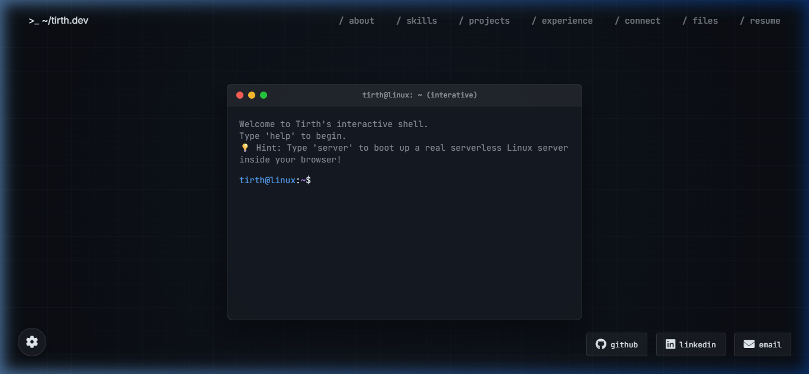
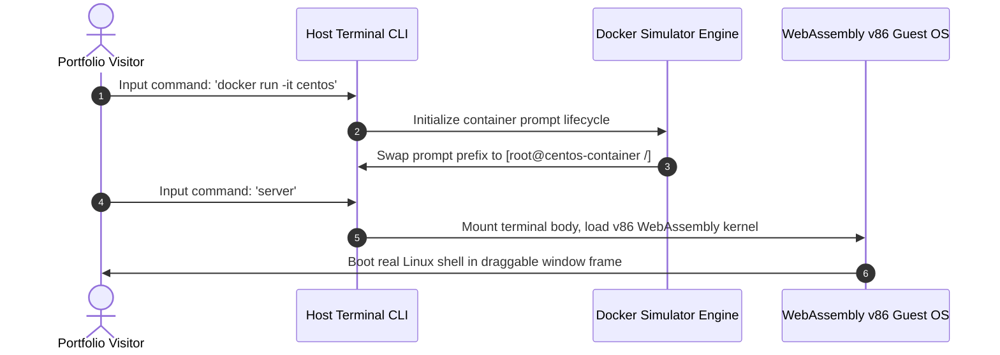

# 💻 Interactive Linux Desktop Portfolio (Serverless Unix Workspace)

<p align="center">
  <a href="https://github.com/tirthpatel90/My-Portfolio-/stargazers"></a>
  <a href="https://github.com/tirthpatel90/My-Portfolio-/network/members"></a>
  <a href="https://github.com/tirthpatel90/My-Portfolio-/blob/main/LICENSE"></a>
</p>

<p align="center">
  
</p>

<p align="center">
  <strong>A premium, fully interactive, browser-based Linux Desktop Environment styled as a Unix workspace. Fully serverless, running mock Docker containers and booting real WebAssembly-based Alpine Linux operating systems locally on the client side!</strong>
</p>

---

## 🌐 Live Mainframe Demo
Try the interactive shell environment live here: **[tirthdev-portfolio.vercel.app](https://tirthdev-portfolio.vercel.app/)**

---

## 🎯 Project Vision
Most developer portfolios are static templates. This repository contains a fully functional **virtual desktop environment** built with vanilla web technologies. It is designed specifically for **DevOps, Cloud, Systems, and Backend Engineers** to showcase infrastructure administration, shell operations, container orchestration, and system configurations interactively.

---

## ✨ Key Capabilities & Mocks

### 🖥️ 1. Client-Side WebAssembly Terminal (Path A)
Spawns a draggable, retro terminal window running a **real, serverless virtual machine emulator** in-browser via WebAssembly (`v86`).
*   **100% Free Hosting:** Virtualization executes entirely in the visitor's browser thread via Wasm. No virtual private servers (VPS) are rented or required, meaning your portfolio hosting is completely free.
*   **Draggable Terminal Overlay:** Fitted with customized, sleek webkit-scrollbars that match your desktop themes.
*   **Supported Operating Systems:** The underlying `v86` emulator runs a real x86 emulation layer in WebAssembly. You can configure it to load several pre-configured operating system profiles:
    *   🐧 **Alpine Linux (Default):** A super-lightweight security-oriented Linux server shell (`profile=alpine`).
    *   🚀 **Arch Linux:** A customized 32-bit Linux terminal containing packages like Python, Git, and system logs (`profile=archlinux`).
    *   📦 **NodeOS:** A lightweight operating system built on top of the Linux kernel, using Node.js as the primary userspace runtime (`profile=nodeos`).
    *   🛠️ **Buildroot Linux:** A minimal embedded Linux setup precompiled with networking utilities (`profile=buildroot`).
    *   💾 **FreeDOS:** A complete, free MS-DOS compatible operating system for running legacy command-line applications (`profile=freedos`).
    *   🛡️ **OpenBSD:** A security-focused, multi-platform Unix-like operating system (`profile=openbsd`).
    *   🐦 **KolibriOS:** An extremely fast assembly-written graphical OS (`profile=kolibrios`).
    *   💻 **Damn Small Linux:** A 50MB lightweight desktop environment precompiled with legacy Firefox web browsers (`profile=dsl`).
    *   🏁 **Windows 98:** A classic retro Windows desktop GUI running in-browser (`profile=windows98`).


### 🐳 2. Simulated Docker Container Engine
Allows recruiters to run mock container commands (`docker run -it centos`) inside the host prompt.
*   **Environment Shifting:** Swaps console variables to warning-red root layouts (`[root@centos-container /]#`).
*   **Isolated Filesystems:** Simulates internal directory structures (`/bin`, `/etc`, `/var`, `/opt`).
*   **InstallerStdout Simulation:** Type `yum install nginx` or `apt install nginx` to execute complete download sequences, package validations, and setup loops mimicking real Linux installer outputs.

### 3. Glassmorphic Desktop Window System
*   **Draggable & Maximizable Windows:** Draggable desktop app containers (`about`, `skills`, `projects`, `experience`, `contributions`, `files`, `connect`) with double-click window focus management.
*   **Theme Switcher Engine:** Change background styles dynamically (Dracula Dark, Matrix Green, GitHub Dark, Tokyo Night, Midnight Black) via console commands (`theme [name]`) or the floating settings gear widget.

---

## 🛠️ Tech Stack
*   **Core Logic & Structure:** HTML5, CSS3, JavaScript (ES6+, Vanilla, 100% Client-Side)
*   **Virtualization Core:** WebAssembly (Wasm via compiled `v86` emulator)
*   **Visual Assets & Layout:** FontAwesome Icons, Google Fonts (JetBrains Mono & Inter)
*   **Mailer System:** Formspree API Integrations

---

## ⚙️ Architecture & Sequence Flow



---

## 🚀 Local Setup & Installation

Because the portfolio loads dynamic cross-origin assets (like the virtual WebAssembly disk images and external links), **modern browsers block file loads if opened directly from local folders (`file://`) due to CORS security rules**. 

To run and preview the codebase locally:

1. **Fork this repository** on GitHub.
2. **Clone the repository** to your local machine:
   ```bash
   git clone https://github.com/your-username/interactive-linux-portfolio.git
   ```
3. **Launch a local server** in the repository root directory:
   * **Python (Recommended):**
     ```bash
     python -m http.server 8000
     ```
     Open `http://localhost:8000` in your browser.
   * **Node.js (Alternative):**
     ```bash
     npx live-server
 
### 7. Change the Default WebAssembly OS Profile
By default, the WebAssembly terminal environment (via the `server` or `wasm` command) boots Alpine Linux. You can easily switch this to run any of the other supported operating systems:
1. Open **`script.js`** and locate the `spawnWasmTerminal()` function.
2. Find the code line loading the `iframe` element (around line 1057):
   ```html
   <iframe class="wasm-terminal-frame" src="https://copy.sh/v86/?profile=alpine" ...>
   ```
3. Change the `profile` parameter value from `alpine` to any of the other supported profiles:
   * **Arch Linux:** `?profile=archlinux`
   * **NodeOS:** `?profile=nodeos`
   * **Buildroot:** `?profile=buildroot`
   * **FreeDOS:** `?profile=freedos`
   * **OpenBSD:** `?profile=openbsd`
   * **KolibriOS:** `?profile=kolibrios`
   * **Damn Small Linux:** `?profile=dsl`
   * **Windows 98:** `?profile=windows98`
4. Update the title text in the terminal window header (around line 1054) to match the selected OS:
   ```javascript
   <div class="header-title"><i class="fas fa-microchip"></i> mainframe-core // WebAssembly Arch Linux</div>
   ```


---

### Supported OS Profiles

| OS | Description | Profile Parameter |
|---|---|---|
| Alpine Linux | Lightweight server OS | `alpine` |
| Arch Linux | Rolling release Linux distro | `archlinux` |
| NodeOS | Node.js as init system | `nodeos` |
| Buildroot Linux | Minimal embedded Linux | `buildroot` |
| FreeDOS | MS-DOS compatible OS | `freedos` |
| OpenBSD | Security-focused Unix | `openbsd` |
| KolibriOS | Assembly graphical OS | `kolibrios` |
| Damn Small Linux | Tiny Linux with X and Firefox | `dsl` |
| Windows 98 | Classic Windows GUI | `windows98` |

---


## 🔧 How to Customize This Portfolio for Yourself

This project is built to be extremely beginner-friendly. All personalization content is extracted into a single configuration file: **[config.js](file:///c:/Users/tirth/Portfolio/config.js)**.

### 1. Centralized Configuration (config.js)
Open **`config.js`** in your editor and customize the values in the `CONFIG` object:
*   **Page Metadata:** Change `pageTitle` and `logoPrompt`.
*   **Terminal Details:** Change `terminalUser` and `terminalHost` to update console prefixes.
*   **Bio/About Details:** Edit fields under `about` to reflect your name, role, learning interests, and coordinates.
*   **Skills Tree:** Modify the `skills.treeCol1` and `skills.treeCol2` ASCII text layout columns.
*   **Projects, Experience, & Contributions:** Update lists of projects, experience, and open-source contributions. They will be formatted and rendered automatically.
*   **Formspree Mailer:** Set your Formspree form ID under `connect.formspreeId` to receive form submissions.
*   **Social & Resume Links:** Update the `socials` array with your profile links and icons, and define the `resumeUrl` path.

### 2. Replace Static Assets
*   **Profile Image:** Place your profile picture named `profile.jpg` in the root folder (or update the path in `config.js`).
*   **Resume PDF:** Place your resume named `Resume.pdf` in the root folder (or update the path in `config.js`).

---

## 🤝 Contribution Guidelines

We welcome contributions to this open-source portfolio project! Please refer to the **[CONTRIBUTING.md](file:///c:/Users/tirth/Portfolio/CONTRIBUTING.md)** file for guidelines on how to report issues, suggest features, and submit pull requests.

---

## 📄 License & Badges
This repository is open-sourced under the [MIT License](LICENSE). Feel free to use, modify, and deploy this workspace for your own professional portfolio!

*If you found this codebase useful, please **give it a Star (⭐)**! It helps other Cloud/DevOps engineers discover this open-source project.*
