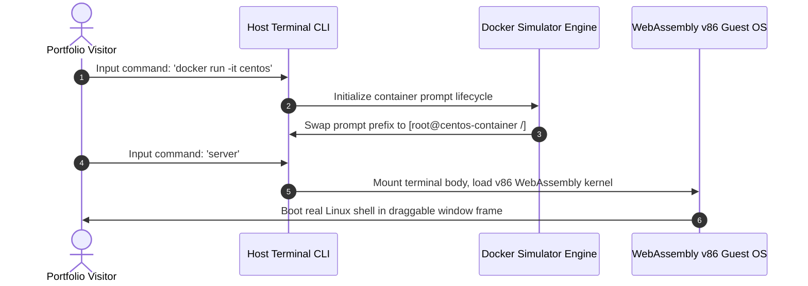

# 💻 Interactive Linux Desktop Portfolio (Serverless Unix Workspace)

<p align="center">
  <a href="https://github.com/tirthpatel90/My-Portfolio-/stargazers"></a>
  <a href="https://github.com/tirthpatel90/My-Portfolio-/network/members"></a>
  <a href="https://github.com/tirthpatel90/My-Portfolio-/blob/main/LICENSE"></a>
</p>

<p align="center">
  <strong>A premium, fully interactive, browser-based Linux Desktop Environment styled as a Unix workspace. Fully serverless, running mock Docker containers and booting real WebAssembly-based Alpine Linux operating systems locally on the client side!</strong>
</p>

---

## 🌐 Live Mainframe Demo
Try the interactive shell environment live here: **[tirthdev-portfolio.vercel.app](https://tirthdev-portfolio.vercel.app/)**

---

## 🎯 Project Vision
Most developer portfolios are static templates. This repository contains a fully functional **virtual desktop environment** built with vanilla web technologies. It is designed specifically for **DevOps, Cloud, Systems, and Backend Engineers** to showcase infrastructure administration, shell operations, container orchestration, and system configurations interactively.

---

## ✨ Key Capabilities & Mocks

### 🖥️ 1. Client-Side WebAssembly Terminal (Path A)
Spawns a draggable, retro terminal window running a **real, serverless Alpine Linux kernel** in-browser via WebAssembly (`v86`).
*   **100% Free Hosting:** Virtualization executes entirely in the visitor's browser thread via Wasm. No virtual private servers (VPS) are rented or required.
*   **Full Terminal Emulator:** Boots from a compressed x86 Alpine disk image and runs commands locally.

### 🐳 2. Simulated Docker Container Engine
Allows recruiters to run mock container commands (`docker run -it centos`) inside the host prompt.
*   **Environment Shifting:** Swaps console variables to warning-red root layouts (`[root@centos-container /]#`).
*   **Isolated Filesystems:** Simulates internal directory structures (`/bin`, `/etc`, `/var`, `/opt`).
*   **InstallerStdout Simulation:** Type `yum install nginx` or `apt install nginx` to execute complete download sequences, package validations, and setup loops mimicking real Linux installer outputs.

### 🎨 3. Glassmorphic Desktop Window System
*   **Draggable & Maximizable Windows:** Draggable desktop app containers (`about`, `skills`, `projects`, `files`, `connect`) with double-click window focus management.
*   **Theme Switcher Engine:** Change background styles dynamically (Dracula Dark, Matrix Green, GitHub Dark, Tokyo Night, Midnight Black) via console commands (`theme [name]`) or the floating settings gear widget.

---

## 🛠️ Tech Stack
*   **Core Logic & Structure:** HTML5, CSS3, JavaScript (ES6+, Vanilla, 100% Client-Side)
*   **Virtualization Core:** WebAssembly (Wasm via compiled `v86` emulator)
*   **Visual Assets & Layout:** FontAwesome Icons, Google Fonts (JetBrains Mono & Inter)
*   **Mailer System:** Formspree API Integrations

---

## ⚙️ Architecture & Sequence Flow



---

## 🚀 Local Setup & Installation

Because the portfolio loads dynamic cross-origin assets (like the virtual WebAssembly disk images and external links), **modern browsers block file loads if opened directly from local folders (`file://`) due to CORS security rules**. 

To run and preview the codebase locally:

1. **Fork this repository** on GitHub.
2. **Clone the repository** to your local machine:
   ```bash
   git clone https://github.com/your-username/My-Portfolio-.git
   ```
3. **Launch a local server** in the repository root directory:
   * **Python (Recommended):**
     ```bash
     python -m http.server 8000
     ```
     Open `http://localhost:8000` in your browser.
   * **Node.js (Alternative):**
     ```bash
     npx live-server
     ```

---

## 🎨 How to Customize the Portfolio for Yourself

This project is built to be easily customizable so that other developers can use it as their own portfolio:

### 1. Update Personal Metadata (Bio & Profile Image)
*   **Replace Profile Photo:** Overwrite the `profile.jpg` file in the root folder with your own headshot.
*   **Modify About Me section:** Open [script.js](file:///c:/Users/tirth/Portfolio/script.js) and update the `sections.whoami.content` string with your bio, details, and GMT timezone details.

### 2. Update Skills Inventory
*   Open [script.js](file:///c:/Users/tirth/Portfolio/script.js) and locate `sections.skills.content`. Customize the monospace tree-diagram text:
    ```
    ├── Languages
    │   ├── JavaScript
    │   └── Python
    ```

### 3. Setup Your Mailbox
*   Go to [Formspree](https://formspree.io/) and create a free form.
*   Open [script.js](file:///c:/Users/tirth/Portfolio/script.js) and locate `sections.connect.content`. Update the Formspree endpoint URL in the form action to point to your new Formspree ID:
    ```html
    <form id="connect-form" action="https://formspree.io/f/YOUR_FORM_ID" method="POST">
    ```

---

## 🤝 Contribution Guidelines

We welcome contributions to this open-source portfolio project! To contribute:
1. **Report Bugs / Feature Requests:** Open a GitHub Issue detailing the query.
2. **Submit Code Upgrades:**
   * Create a new feature branch (`git checkout -b feature/cool-upgrade`).
   * Commit your changes (`git commit -m "feat: add cyber security scan simulator"`).
   * Open a Pull Request for review!

---

## 📄 License & Badges
This repository is open-sourced under the [MIT License](LICENSE). Feel free to use, modify, and deploy this workspace for your own professional portfolio!

*If you found this codebase useful, please **give it a Star (⭐)**! It helps other Cloud/DevOps engineers discover this open-source project.*
