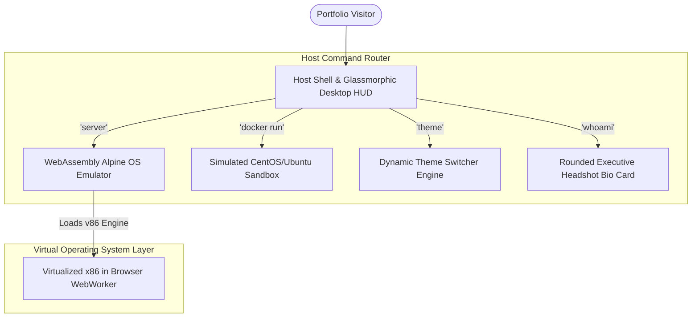

# 💻 ~/tirth.dev | Interactive Linux Shell & DevOps Portfolio

<p align="center">
  
  
  
</p>

<p align="center">
  <strong>A premium, fully interactive, Unix-themed developer portfolio featuring draggable desktop windows, a functional host shell, an isolated Docker simulator, and a real serverless WebAssembly Linux operating system!</strong>
</p>

---

## 🌟 Live Demo
👉 Experience the interactive mainframe environment live: **[tirthdev-portfolio.vercel.app](https://tirthdev-portfolio.vercel.app/)**

---

## 🚀 Key Highlights & "Wow" Features

### 🖥️ 1. WebAssembly Linux Server (100% Free & Secure)
Boot up a real, fully functional x86 Alpine Linux operating system directly inside a draggable retro terminal window!
*   **Browser-Side Emulation:** Powered by client-side WebAssembly (`v86`). The entire OS boots in under 5 seconds, using the visitor's browser CPU/RAM to virtualize CPU cycles, hardware clocks, and terminal interfaces with **zero backend server costs**.
*   **Themed Draggable Console:** Complete with an integrated styled scrollbar that blends with your theme, allowing you to browse different OS types (Alpine, Arch Linux, Android, ELKS) easily.

### 🐳 2. Simulated Docker Container Sandbox
Need a CentOS or Ubuntu sandbox? Type `docker run -it centos` in the host shell to spin up an isolated virtual container prompt!
*   **Dynamic Prompt Transitions:** Prompts swap to warnings-red root configurations (`[root@centos-container /]#`).
*   **Isolated Command Set:** Run sandbox-specific commands (`ls` lists simulated CentOS directory trees, `whoami` outputs `root`).
*   **Installer Progress Loops:** Type `yum install nginx` or `apt install nginx` to trigger full downloading, package dependency verification, and installer speed progress loops matching real Linux stdout outputs!

### 🎨 3. Sleek Glassmorphic Retro Mainframe HUD
*   **Draggable Windows:** A custom window manager allows visitors to drag, collapse, maximize, and stack multiple applications (`about`, `skills`, `projects`, `files`, `connect`).
*   **Unified Custom Scrollbars:** Standard scrollbars are completely replaced with an ultra-thin, sleek glassmorphic scrollbar that matches your active theme automatically.
*   **Quick Themes Engine:** Change your environment restyling on the fly (Dracula, Matrix Green, GitHub Dark, Tokyo Night, Midnight Black) using the settings gear widget or the terminal `theme [name]` CLI.

---

## 🛠️ Tech Stack & Architecture

<p align="center">
  
  
  
  
  
  
</p>

### System Architecture Flow



---

## 📁 Repository Structure
```
.
├── index.html         # Main workspace markup & terminal elements
├── style.css          # Glassmorphism desktop tokens, keyframe glits, and customized scrollbars
├── script.js         # Core shell routers, autocompletes, Wasm iframe launchers & Docker state engines
├── profile.jpg        # Executive profile photo
├── Resume.pdf         # Professional downloadable resume
└── README.md          # Project overview & documentation
```

---

## 💻 Console Commands List

| Command | Arguments | Description |
| :--- | :--- | :--- |
| **`help`** | None | Prints available workspace command specifications. |
| **`server`** | None | Launches the draggable WebAssembly x86 Alpine Linux server. |
| **`docker`** | `ps` \| `images` \| `run -it [centos/ubuntu]` | Manages the simulated isolated CentOS/Ubuntu containers. |
| **`whoami`** | None | Opens the About Me bio card featuring your real picture. |
| **`skills`** | None | Opens the interactive visual programming language tree. |
| **`projects`**| None | Logs all active software development deployments. |
| **`experience`**| None | Logs Azure internship timelines and background. |
| **`files`** | None | Launches the double-clickable folder browser. |
| **`theme`** | `[dracula/matrix/github/tokyonight/midnight]` | Switches the system colors on the fly. |
| **`connect`** | None | Opens the SMTP-ready Formspree mailbox window. |
| **`clear`** | None | Clears the host console logs history. |

---

## 🤝 Hosting & Customization (100% Serverless)

This portfolio is **100% serverless, static, and client-side**. It requires absolutely zero database setups, node servers, or paid hosting environments. You can host it completely free on Vercel, Netlify, or GitHub Pages!

If you want to host your own version:

1. **Fork the Repo:** Click the **Fork** button at the top right of this page.
2. **Deploy instantly:** Simply link the forked repository to Vercel, Netlify, or enable **GitHub Pages** in your repository settings! It will compile and host instantly for free.
3. **Local Testing (Optional):** If you want to preview the files locally on your computer before pushing, modern browsers block cross-origin iframes (like the v86 emulator) when opened via `file://` protocols due to security rules. To bypass this locally, run a lightweight local helper server in your terminal:
   * **Python:** `python -m http.server 8000` (and visit `http://localhost:8000`)
   * **Node.js:** `npx live-server`

---

## ⭐ Star the Repo!
If you love this interactive Unix-style hypervisor portfolio, please **give this repository a Star!** It helps other DevOps, Cloud, and Systems Engineers discover this project.

### Let's Connect!
💼 **[LinkedIn Profile](https://www.linkedin.com/in/tirth-patel-3bbb30288)**  
📧 **[tirthpatel5393@gmail.com](mailto:tirthpatel5393@gmail.com)**
